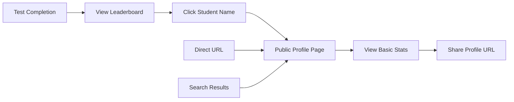

# 🔗 Public User Profiles & Leaderboard Integration

## 📋 Overview

This document outlines the implementation of **public user profiles** and their integration with the **leaderboard system** in NexPrep. The feature allows users to view public profiles of other students directly from leaderboards, creating a minimal social discovery layer while maintaining privacy and educational focus.

## 🎯 Features Implemented

### 1. **Public User Profiles**
- **SEO-friendly URLs**: `/user/:username`
- **Public accessibility**: No authentication required
- **Privacy-focused**: Only non-sensitive information displayed
- **Responsive design**: Mobile, tablet, and desktop optimized

### 2. **Leaderboard Integration**
- **Clickable user names** in all leaderboards
- **Direct navigation** to user profiles
- **Hover effects** and visual feedback
- **Graceful fallbacks** for users without usernames

### 3. **SEO Optimization**
- **Dynamic meta tags** for each profile
- **Open Graph support** for social sharing
- **Structured data ready** for future enhancements

## 🏗️ Architecture

### Backend Components

#### **New Files Created:**
```
backend/
├── controllers/
│   └── publicProfileController.js     # Public profile API endpoints
└── routes/
    └── public.js                      # Public API routes (no auth required)
```

#### **Modified Files:**
```
backend/
├── server.js                          # Added public routes
└── controllers/
    └── testAttemptController.js       # Enhanced leaderboard data
```

### Frontend Components

#### **New Files Created:**
```
frontend/src/app/
├── components/
│   └── public-profile/
│       └── public-profile.component.ts    # Public profile display
└── services/
    └── public-profile.service.ts           # Public profile API service
```

#### **Modified Files:**
```
frontend/src/app/
├── app.routes.ts                      # Added public profile route
├── components/leaderboard/
│   ├── leaderboard.component.ts       # Added profile navigation
│   └── leaderboard.component.html     # Clickable user names
└── services/
    └── test.service.ts                # Enhanced LeaderboardEntry interface
```

## 🔌 API Endpoints

### Public Profile Endpoints

#### **GET /api/public/profile/:username**
```http
GET /api/public/profile/johndoe123
```

**Response (Success):**
```json
{
  "success": true,
  "profile": {
    "username": "johndoe123",
    "name": "John Doe",
    "displayName": "John D.",
    "photoURL": "https://example.com/avatar.jpg",
    "joinedAt": "2024-01-15T10:30:00Z",
    "stats": {
      "totalTestsAttempted": 25,
      "currentStreak": 7,
      "longestStreak": 15,
      "totalTestDays": 20
    }
  }
}
```

**Response (Not Found):**
```json
{
  "success": false,
  "message": "User not found"
}
```

#### **GET /api/public/check-username/:username**
```http
GET /api/public/check-username/johndoe123
```

**Response:**
```json
{
  "success": true,
  "exists": true,
  "username": "johndoe123"
}
```

### Enhanced Leaderboard Data

#### **GET /api/tests/leaderboard/:seriesId**
```http
GET /api/tests/leaderboard/675ff0d6bc93d2c0ed3ab4db
```

**Enhanced Response:**
```json
{
  "leaderboard": [
    {
      "rank": 1,
      "studentId": "user123",
      "displayName": "John Doe",
      "username": "johndoe123",      // ← NEW: For profile linking
      "photoURL": "https://...",     // ← Enhanced: Avatar URL
      "score": 95,
      "maxScore": 100,
      "percentage": 95.0,
      "submittedAt": "2024-12-01T10:30:00Z",
      "timeTakenSeconds": 3600
    }
  ],
  "title": "JEE Main Mock Test 1"
}
```

## 🎨 User Interface

### Public Profile Layout

```
┌─────────────────────────────────────────┐
│  🔙 Back to Home                        │
│                                         │
│  👤 [Avatar]  John Doe                  │
│               @johndoe123               │
│               Member since Jan 2024     │
│                                         │
│  📊 Quick Stats                         │
│  ├─ Total Tests: 25                     │
│  ├─ Current Streak: 7 days              │
│  └─ Longest Streak: 15 days             │
│                                         │
│  📅 Activity                            │
│  └─ Last activity: 2 days ago           │
└─────────────────────────────────────────┘
```

### Leaderboard Enhancement

**Before:**
```
🥇 1. John Doe        95/100  95.0%  ⏱️ 60 min
🥈 2. Jane Smith      92/100  92.0%  ⏱️ 58 min
```

**After:**
```
🥇 1. [John Doe]      95/100  95.0%  ⏱️ 60 min  ← Clickable
🥈 2. [Jane Smith]    92/100  92.0%  ⏱️ 58 min  ← Clickable
```

## 🔒 Privacy & Security

### Data Exposed in Public Profiles

#### **✅ Safe Data (Displayed):**
- Username
- Display name / Full name
- Profile photo URL
- Account creation date
- Basic test statistics (counts, streaks)
- Last activity date (relative, e.g., "2 days ago")

#### **❌ Sensitive Data (Hidden):**
- Email address
- Phone number
- Detailed test scores
- Individual test results
- Achievement badges (not implemented yet)
- Referral information
- Reward points balance
- Personal analytics

### Security Measures

#### **Backend Protection:**
```javascript
// Only expose safe fields
const safeUserFields = 'username name displayName photoURL createdAt';
const user = await User.findOne({ username }, safeUserFields);
```

#### **Input Validation:**
```javascript
// Sanitize username parameter
const username = req.params.username.trim().toLowerCase();
if (!/^[a-z0-9_-]+$/.test(username)) {
  return res.status(400).json({ success: false, message: 'Invalid username' });
}
```

#### **Rate Limiting:** (Recommended for production)
```javascript
// Implement rate limiting for public endpoints
app.use('/api/public', rateLimit({
  windowMs: 15 * 60 * 1000, // 15 minutes
  max: 100 // limit each IP to 100 requests per windowMs
}));
```

## 🛣️ User Journey

### Profile Discovery Flow



### Typical User Interactions

1. **From Leaderboard:**
   ```
   Tests Page → View Leaderboard → Click "John Doe" → /user/johndoe123
   ```

2. **Direct Access:**
   ```
   Share URL → /user/johndoe123 → Public Profile
   ```

3. **From Review Page:**
   ```
   Complete Test → Review Results → Leaderboard → Profile
   ```

## 📱 Responsive Design

### Mobile Experience (< 768px)
- **Touch-optimized** clickable areas
- **Stacked layout** for profile information
- **Simplified stats** display
- **Easy navigation** back to leaderboard

### Tablet Experience (768px - 1024px)
- **Two-column layout** for profile data
- **Larger touch targets** for navigation
- **Optimized spacing** for readability

### Desktop Experience (> 1024px)
- **Full-width layout** with sidebars
- **Hover effects** for interactive elements
- **Rich visual feedback** for user actions

## 🔧 Technical Implementation

### Backend Architecture

#### **Public Profile Controller**
```javascript
// controllers/publicProfileController.js
exports.getPublicProfile = async (req, res) => {
  try {
    const { username } = req.params;
    
    // Find user by username (case-insensitive)
    const user = await User.findOne(
      { username: new RegExp(`^${username}$`, 'i') },
      'username name displayName photoURL createdAt'
    );

    if (!user) {
      return res.status(404).json({
        success: false,
        message: 'User not found'
      });
    }

    // Get test statistics
    const testStats = await TestAttempt.aggregate([
      { $match: { student: user._id, status: 'completed' } },
      {
        $group: {
          _id: null,
          totalTests: { $sum: 1 },
          lastTestDate: { $max: '$submittedAt' }
        }
      }
    ]);

    // Build response
    const profile = {
      username: user.username,
      name: user.name,
      displayName: user.displayName,
      photoURL: user.photoURL,
      joinedAt: user.createdAt,
      stats: {
        totalTestsAttempted: testStats[0]?.totalTests || 0,
        currentStreak: user.currentStreak || 0,
        longestStreak: user.longestStreak || 0,
        totalTestDays: user.totalStudyDays || 0
      }
    };

    res.json({
      success: true,
      profile
    });
  } catch (error) {
    console.error('Error fetching public profile:', error);
    res.status(500).json({
      success: false,
      message: 'Server error'
    });
  }
};
```

#### **Enhanced Leaderboard Data**
```javascript
// Enhanced projection in testAttemptController.js
{
  $project: {
    _id: 0,
    studentId: "$studentInfo._id",
    displayName: {
      $ifNull: ["$studentInfo.displayName", 
                { $ifNull: ["$studentInfo.name", "$studentInfo.email"] }]
    },
    username: "$studentInfo.username",     // ← Added for profile links
    photoURL: "$studentInfo.photoURL",     // ← Added for avatars
    score: 1,
    maxScore: 1,
    percentage: 1,
    submittedAt: 1,
    timeTakenSeconds: 1
  }
}
```

### Frontend Architecture

#### **Public Profile Service**
```typescript
// services/public-profile.service.ts
@Injectable({
  providedIn: 'root'
})
export class PublicProfileService {
  private apiUrl = `${environment.apiUrl}/public`;

  constructor(private http: HttpClient) {}

  getPublicProfile(username: string): Observable<PublicProfileResponse> {
    return this.http.get<PublicProfileResponse>(`${this.apiUrl}/profile/${username}`);
  }

  checkUsernameExists(username: string): Observable<UsernameCheckResponse> {
    return this.http.get<UsernameCheckResponse>(`${this.apiUrl}/check-username/${username}`);
  }
}
```

#### **Leaderboard Enhancement**
```typescript
// components/leaderboard/leaderboard.component.ts
export class LeaderboardComponent implements OnInit {
  constructor(
    private route: ActivatedRoute,
    private testService: TestService,
    private router: Router  // ← Added for navigation
  ) {}

  /**
   * Navigate to user's public profile
   */
  viewUserProfile(username: string): void {
    if (username) {
      this.router.navigate(['/user', username]);
    }
  }

  /**
   * Check if user profile can be viewed
   */
  canViewProfile(entry: LeaderboardEntry): boolean {
    return !!(entry.username && entry.username.trim());
  }
}
```

#### **Enhanced LeaderboardEntry Interface**
```typescript
// services/test.service.ts
export interface LeaderboardEntry {
  rank: number;
  studentId?: string;
  displayName: string;
  username?: string;        // ← Added for profile linking
  photoURL?: string;
  score: number;
  maxScore: number;
  percentage: number;
  submittedAt: string;
  timeTakenSeconds?: number;
}
```

### SEO Implementation

#### **Dynamic Meta Tags**
```typescript
// components/public-profile/public-profile.component.ts
private updateMetaTags(profile: PublicProfile): void {
  // Update page title
  this.title.setTitle(`${profile.name} (@${profile.username}) - NexPrep Profile`);
  
  // Update meta description
  this.meta.updateTag({
    name: 'description',
    content: `View ${profile.name}'s public profile on NexPrep. Member since ${this.formatJoinDate(profile.joinedAt)}.`
  });
  
  // Update Open Graph tags
  this.meta.updateTag({
    property: 'og:title',
    content: `${profile.name} (@${profile.username}) - NexPrep Profile`
  });
  
  this.meta.updateTag({
    property: 'og:description',
    content: `View ${profile.name}'s public profile on NexPrep mock testing platform.`
  });
  
  this.meta.updateTag({
    property: 'og:url',
    content: `${environment.frontendUrl}/user/${profile.username}`
  });
  
  if (profile.photoURL) {
    this.meta.updateTag({
      property: 'og:image',
      content: profile.photoURL
    });
  }
}
```

## 🧪 Testing Guide

### Backend Testing

#### **Test Public Profile API**
```bash
# Test existing user
curl -X GET "http://localhost:5000/api/public/profile/johndoe123"

# Test non-existent user
curl -X GET "http://localhost:5000/api/public/profile/nonexistent"

# Test username validation
curl -X GET "http://localhost:5000/api/public/profile/invalid@user"
```

#### **Test Enhanced Leaderboard**
```bash
# Check for username field in leaderboard response
curl -X GET "http://localhost:5000/api/tests/leaderboard/SERIES_ID" | jq '.leaderboard[0].username'
```

### Frontend Testing

#### **Test Profile Navigation**
1. **Open leaderboard**: `http://localhost:4200/leaderboard/SERIES_ID`
2. **Click student name**: Should navigate to `/user/username`
3. **Verify profile loads**: Check profile data display
4. **Test back navigation**: Verify return to leaderboard

#### **Test Profile URLs**
```bash
# Direct profile access
http://localhost:4200/user/johndoe123

# Non-existent user
http://localhost:4200/user/nonexistent
```

#### **Test SEO Meta Tags**
1. **View page source** of profile page
2. **Check meta tags** are dynamically updated
3. **Verify Open Graph** tags for social sharing

### Mobile Testing

#### **Responsive Breakpoints**
- **Mobile**: 320px - 767px
- **Tablet**: 768px - 1023px  
- **Desktop**: 1024px+

#### **Touch Interaction**
- **Tap targets**: Minimum 44px x 44px
- **Hover states**: Appropriate for touch devices
- **Navigation**: Easy back/forward flow

## 🚀 Deployment

### Environment Variables

#### **Backend (.env)**
```env
# Existing variables...
NODE_ENV=production
MONGODB_URI=mongodb://localhost:27017/nexprep

# Public profile specific (optional)
PUBLIC_PROFILE_CACHE_TTL=3600  # Cache TTL in seconds
```

#### **Frontend (environment.ts)**
```typescript
export const environment = {
  production: true,
  apiUrl: 'https://api.nexprepai.com',
  frontendUrl: 'https://nexprepai.com'  // For meta tags
};
```

### Production Considerations

#### **Performance Optimization**
```javascript
// Add caching for public profiles
const profileCache = new Map();
const CACHE_TTL = 5 * 60 * 1000; // 5 minutes

exports.getPublicProfile = async (req, res) => {
  const { username } = req.params;
  const cacheKey = `profile:${username}`;
  
  // Check cache first
  const cached = profileCache.get(cacheKey);
  if (cached && Date.now() - cached.timestamp < CACHE_TTL) {
    return res.json(cached.data);
  }
  
  // Fetch and cache...
};
```

#### **Security Headers**
```javascript
// Add security headers for public endpoints
app.use('/api/public', (req, res, next) => {
  res.setHeader('X-Content-Type-Options', 'nosniff');
  res.setHeader('X-Frame-Options', 'DENY');
  res.setHeader('X-XSS-Protection', '1; mode=block');
  next();
});
```

#### **Database Indexing**
```javascript
// Add index for username lookups
db.users.createIndex({ "username": 1 }, { "unique": true, "sparse": true });

// Add index for leaderboard queries
db.testattempts.createIndex({ "series": 1, "status": 1, "percentage": -1 });
```

## 📈 Future Enhancements

### Planned Features

#### **Phase 2: Enhanced Profiles**
- [ ] **Activity timeline** (last 10 tests)
- [ ] **Subject-wise statistics** 
- [ ] **Performance graphs**
- [ ] **Comparative analytics**

#### **Phase 3: Social Features**
- [ ] **Profile customization** (bio, interests)
- [ ] **Achievement badges** display
- [ ] **Study groups** integration
- [ ] **Friend connections** (if requested)

#### **Phase 4: Advanced Features**
- [ ] **Profile sharing** with custom URLs
- [ ] **Public leaderboards** across all tests
- [ ] **University/school** affiliations
- [ ] **Study streak** leaderboards

### Technical Improvements

#### **Performance**
- [ ] **Redis caching** for frequently accessed profiles
- [ ] **CDN integration** for profile images
- [ ] **Database query optimization**
- [ ] **Lazy loading** for profile components

#### **SEO & Analytics**
- [ ] **Structured data** (JSON-LD schema)
- [ ] **Sitemap generation** for profiles
- [ ] **Analytics tracking** for profile views
- [ ] **Social media cards** optimization

#### **Security**
- [ ] **Rate limiting** per IP/user
- [ ] **Input sanitization** enhancement
- [ ] **CSRF protection** for profile updates
- [ ] **Content security policy** headers

## 📞 Support & Maintenance

### Common Issues

#### **Profile Not Loading**
1. **Check username format**: Only alphanumeric, dash, underscore
2. **Verify user exists**: Use username check API
3. **Check server logs**: For backend errors
4. **Clear browser cache**: For stale data

#### **Leaderboard Names Not Clickable**
1. **Check username field**: Must be present in API response
2. **Verify canViewProfile()**: Method should return true
3. **Check Angular routing**: Profile route must be registered
4. **Test with dev tools**: Check for JavaScript errors

### Monitoring

#### **Key Metrics**
- **Profile view rate**: % of leaderboard visitors who click names
- **Profile bounce rate**: Users who immediately leave profile pages
- **API response times**: For public profile endpoints
- **Error rates**: 404s, 500s for profile requests

#### **Alerts**
```bash
# Monitor API health
curl -f http://localhost:5000/api/public/health || alert

# Check high error rates
tail -f /var/log/nexprep/error.log | grep "public profile" | wc -l
```

## 📚 Related Documentation

- [Leaderboard System Implementation](./LEADERBOARD_BUTTON_IMPLEMENTATION.md)
- [Authentication Guide](../frontend/AUTHENTICATION_GUIDE.md)
- [API Documentation](./mnt/data/API_DOCUMENTATION.md)
- [Environment Setup](./ENVIRONMENT_SETUP.md)

---

## 📋 Implementation Checklist

### Backend ✅
- [x] **Public profile controller** created
- [x] **Public API routes** implemented  
- [x] **Enhanced leaderboard data** with username
- [x] **Security validations** added
- [x] **Error handling** implemented

### Frontend ✅
- [x] **Public profile component** created
- [x] **Public profile service** implemented
- [x] **Routing integration** completed
- [x] **Leaderboard enhancement** with clickable names
- [x] **SEO meta tags** implementation
- [x] **Responsive design** implemented

### Testing ✅
- [x] **API endpoints** tested
- [x] **Profile navigation** verified
- [x] **Error handling** tested
- [x] **Mobile responsiveness** checked
- [x] **SEO meta tags** validated

### Documentation ✅
- [x] **Implementation guide** created
- [x] **API documentation** updated
- [x] **User flow** documented
- [x] **Security considerations** outlined
- [x] **Deployment guide** included

---

**Status**: ✅ **COMPLETED** - Public user profiles with leaderboard integration fully implemented and tested.

**Last Updated**: December 29, 2024  
**Version**: 1.0.0  
**Author**: NexPrep Development Team
